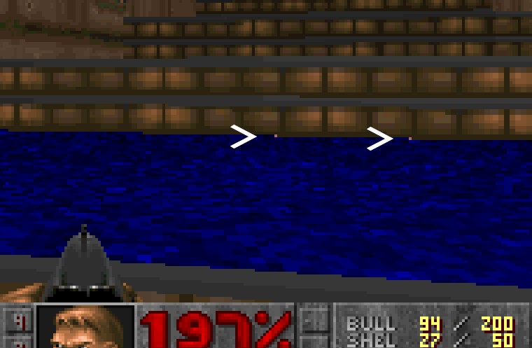
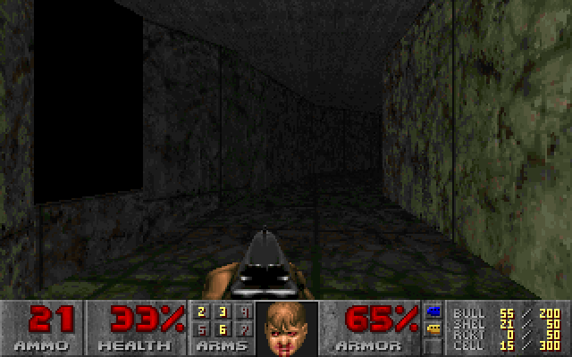
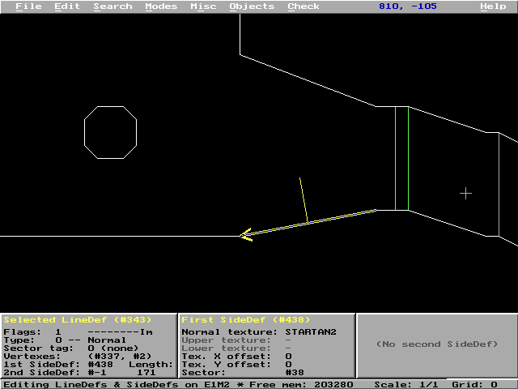
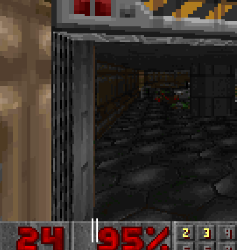

Headless Doom aims to be as similar to Doom as possible while
still meeting the requirements of a benchmark program, i.e. repeatable
behavior and portability.

Doom has various bugs which cause it to access undefined memory or
limit portability. Headless Doom fixes these, but does not make
other alterations.

I have classified all of the bugs which were
fixed in Headless Doom and assigned identifiers to them.

# DSB-1 - Missing explicit integer types

In some C compilers, you can write `static x` or `register x`
and `int` is implicit. For example:

     static nexttic = 0;

# DSB-2 - Ambiguous assignment with post/pre-increment

A single statement combines two assignments, e.g.

     eventhead = (++eventhead)&(MAXEVENTS-1);

# DSB-3 - Assumption that pointers are 32-bit

Generally, this takes the form of casting pointers to/from integers,
but in some places a size of 4 bytes is explicitly used when calculating
memory sizes, and in some others, it is assumed that pointers
are the same size as `int`.

Note that Headless Doom keeps Doom's assumption that `int` is a 32-bit type.

# DSB-4 - Assumption that char is signed

On x86, `char` is conventionally a signed type, but the C standard
does not specify this, and on other platforms, e.g. ARM, it is unsigned.
This affects demo playback through the `ticcmd_t` data structure
in which `signed char` types represent parts of a movement vector.

# DSB-5 - Headless Doom should play demos rather than an interactive game

`D_DoAdvanceDemo` and `IdentifyVersion` are replaced by functions
in the `headless.c` test harness file, so that Doom is driven through
the DDQ demo files without any user interaction. This feature is
activated when `HEADLESS` is defined.

# DSB-6 - Replace system-specific defines, header files

Linux Doom used various system-specific headers such as `unistd.h`
and defines such as `NORMALUNIX` and `LINUX`. These appeared in many
source files. They are removed, and generally replaced by including
`headless.h` if `HEADLESS` is defined.

Aside from bug fixes, the source code will compile in the same way as
vanilla Linux Doom if `-DNORMALUNIX -DLINUX` are used in `CFLAGS`
without `-DHEADLESS`.

# DSB-7 - Log messages for the start of a new demo or a new level

Headless Doom logs these important events using modifications in
`g_game.c`.

# DSB-8 - GameMission\_t / GameMode\_t mixup

Tests of `gamemode` wrongly used enumeration values from
`GameMission_t`, causing compilation errors. The original
behavior is preserved.

# DSB-9 - Incorrect memset bounds in G\_DoLoadLevel

`memset` functions in `G_DoLoadLevel` should clear all
of the provided memory area, but instead they clear
only a small part (often the size of a pointer). For example:

    memset (players[i].frags,0,sizeof(players[i].frags)); 

The correct size is provided.

# DSB-10 - Pointer targets differ in signedness

Both `strcmp` parameters are `char *`, but `unsigned char`
was used instead. Example:

    if (strcmp (save_p, vcheck)) 

Resolved by a type cast.

# DSB-11 - System-specific networking, sound and video code

Headless Doom is not interactive and does not use any network,
video or sound, so the whole contents of `i_net.c`
`i_video.c` and `i_sound.c` are removed by `#ifndef HEADLESS`.
Functions in these files are replaced in `headless.c`,
mostly with empty stubs.

# DSB-12 - Potentially non-deterministic code

Code that accesses a timer or real-time clock is non-deterministic
and will affect the benchmark's operation in various ways. Settings
the `singletics` flag will lead to correct demo playback (as in
vanilla Linux Doom) but won't control all effects. For example,
the screen wipe effect as a new level is loaded is also dependent on
a timer. Therefore, in Headless Doom, calls relating to timing
are replaced by stubs.

Similarly, code that accesses configuration files, saved games
and command-line parameters is replaced by stubs. These inputs
could affect benchmark operation. Configuration file defaults are
replaced by constant values where necessary.

# DSB-13 - NULL sentinel required for sprnames table

The `sprnames` table in `info.c` has a fixed size (`NUMSPRITES`)
but this size is not used by `R_InitSpriteDefs` when reading the
table. Instead, `R_InitSpriteDefs` looks for a NULL value at the
end. This isn't always present, as the C code does not specify it,
and it may just be a matter of chance whether the bytes following
`sprnames` are NULL or not.

# DSB-14 - Possible sprintf overflows for WAD file lump names

`sprintf` is not given a maximum buffer size. Because of the potential
risk of buffer overflow, some C compilers now analyse `sprintf` calls
to determine if memory beyond the end of the buffer might be
overwritten. This can include analysis of the maximum size of
integers and strings that are substituted, e.g. with `%i` or `%s`.

This affects Doom in many places, mostly relating to finding resources
within the WAD file, as each resource has an 1..8-byte key. When
these keys are generated using `sprintf`, the compiler may attempt to
check that more than 9 bytes will not be written (as `sprintf` also
writes a terminating nul byte). Due to a lack of information about the
true bounds of variables, the compiler must pessimistically overestimate
the possible size of string: for example, `"map%i"` would overflow if
there were more than 99999 maps. To deal with these problems in one place,
`M_LumpSprintf` has been added to `m_misc.c` as a replacement for
`sprintf` which is intended specifically for WAD file keys.

# DSB-15 - Possible sprintf overflows in other places

`sprintf` is also used in other places without correct bounding.
For example, the names of save games, printed by the Quick Load feature,
might overflow the buffer.

    char    tempstring[80];
    sprintf(tempstring,QSPROMPT,savegamestrings[quickSaveSlot]);

Calls to `snprintf` are used instead, with an explicit buffer size.

# DSB-16 - Use of fcntl.h and unistd.h for file I/O

Doom used file I/O functions such as `read` and `open`
which are not part of the standard C library. These functions are available in many
C libraries and are a de-facto standard as well as being part of
POSIX, but they are not universal, and there are differences in
the parameters and flags accepted, e.g. `O_BINARY`.

In Headless Doom they are replaced by `stdio.h` functions
i.e. `fread`, `fopen`, etc., or removed entirely in the case
of `M_ReadFile`, which is never used.

# DSB-17 - Namespace clash for "open"

Doom has an enumerated type named `vldoor_e` which defines `open`
as one of the actions relating to doors. This should not clash with
anything in the C library, since the headers that conventionally
declare `open` are not `#include`d. However, as `open` isn't really
part of the standard C library, `open` may be
declared anyway. For example, the Termux version of `stdio.h` defines `open`
[here](https://github.com/termux/termux-packages/blob/57ddad99366c5b84d126b0c72fbb14cc315f0427/ndk-patches/23c/stdio.h.patch#L54).

To reduce such problems, `open` is renamed to `dopen`.

# DSB-18 - Uninitialized local variables

Some functions contain local variables that might be used before being
assigned, as a result of an unexpected code path being taken. For
example, in `EV_BuildStairs`, the value of the local variable `stairsize` will be
uninitialized if `type` is not one of two expected values.

Although other values of `type` may be impossible, the compiler cannot
determine this, and initialisation is a good idea to prevent unpredictable
behavior.

# DSB-19 - Boolean and bitwise operators mixed with unclear operator precedence

GCC and Clang warn about expressions that mix Boolean and bitwise operators
and also rely on potentially unexpected [operator
precedence](https://en.wikipedia.org/wiki/Operators_in_C_and_C%2B%2B). In
`p_spec.c` there is:

    if (!s2->lines[i]->flags & ML_TWOSIDED) ...

This expression does have a well-defined meaning in C:

    if ((!s2->lines[i]->flags) & ML_TWOSIDED) ...

Adding more brackets removes possible ambiguity. Headless Doom preserves the
original meaning of Doom's code here, though it's probably not what
was intended. `ML_TWOSIDED` has value 4, so this condition will never be True.
Some Doom source ports corrected this bug and added compatibility flags for it, e.g. 
[PrBoom](https://github.com/libretro/libretro-prboom/blob/da2dfa749d12f20dfa54ab4b63845988a0c9a14a/src/p_floor.c#L914-L926).

# DSB-20 - Unary minus used with unsigned types

MSVC does not allow the use of the unary `-` operator with an unsigned type, e.g.

    angle2 = -clipangle;

As unsigned types cannot be negative, the use of `-` is not meaningful in
arithmetic terms, though it is still a useful way to force
an overflow around zero, so (for instance) 0x1 becomes 0xffffffff. Subtracting
from 0 is equivalent and accepted by the compiler.

    angle2 = 0-clipangle;

# DSB-21 - drawing pixels outside of short textures

In Doom, wall textures consist of columns of pixels. A column may contain 128
pixels, but can be much shorter. For example a staircase texture such as STEP5
is 32 by 16 pixels.

Drawing is performed by `R_DrawColumn`, which assumes that columns contain
128 pixels, like this:

    do {
        *dest = dc_colormap[dc_source[(frac>>FRACBITS)&127]];
        dest += SCREENWIDTH; 
        frac += fracstep;
    } while (count--); 

If the column actually contains fewer pixels, then `R_DrawColumn`
relies on its input parameters to ensure that the undefined pixels are never
drawn. A Doom level designer can force these undefined pixels to be drawn
anyway by choosing relative sector heights so that the undefined part of the texture
is exposed. This leads to the
[Tutti-frutti effect](https://doomwiki.org/wiki/Tutti-frutti_effect).

Even if the Doom level designer assigns the sector heights correctly,
imprecision in fixed point calculations can still cause `R_DrawColumn` to draw
pixels before and after the end of a short column. The scale factors which
determine `frac`, `count` and `dest` are subject to rounding errors which
can cause `frac` to be negative (before the start of the column) or
greater than the column height. This happens only in rare circumstances,
and for a full-length 128 pixel column, the effect is only that a pixel
will be taken from the top of the texture but drawn at the bottom or vice
versa.

However, for a short column, the effect is that undefined memory
is accessed. For a texture like STEP5 with height 16, pixels 16 .. 127 are
undefined. If `frac` is negative, pixel 127 is accessed. If `frac` overflows,
pixel 16 is accessed. Often, this is not noticeable,
because `R_DrawColumn` draws a pixel from an adjacent column,
or from a nearby column in the case of an underflow, and this is likely
to "look right". But there is no guarantee of this, as the start of the
column may be close to the end of its block of memory.

This screenshot from E1M2 (with headless\_count 902)
shows two instances of the effect on a STEP5 texture. They are highlighted in pink
(Doom color 0xff). The left pixel would normally be taken from the top of the
next column, which is a valid memory location. The right pixel
would be taken from uninitialized memory outside of the texture,
and might have any value.

This problem is not limited to short columns. `R_DrawColumn` may also
draw undefined memory for "masked" columns, which appear in partially
transparent textures. The partially transparent texture is split into "posts",
each of which is a short column. Rounding errors can cause `R_DrawColumn`
to draw pixels before and after the post. The problem is common enough that
Doom actually has a workaround for it: [padding bytes are added at the beginning and end
of each post](https://doomwiki.org/wiki/Picture_format). Unfortunately
the byte at the beginning is not used, because underflow does not result
in accessing `dc_source[-1]`, but rather `dc_source[127]`. This may have
any value, though it's quite likely to be taken from a nearby post, and
so it may still "look right".

Various solutions are possible for this bug, both in terms of implementation
and desired outcome. In terms of outcome, if invalid memory is accessed,
any action is reasonable, such as (for example) always drawing black pixels. But if
underflow/overflow always causes an access to a nearby post or column,
should this also be replaced by black? 

In terms of implementation, it is desirable to avoid 
altering `R_DrawColumn` since it forms a large part of the CPU time
used by Doom. But large code changes are also a bad idea anywhere,
because they move further from the original game code.

Version 1.10 of Headless Doom drew black pixels for
negative `frac` values within a second loop inside `R_DrawColumn`.
This avoided invalid memory accesses due to underflow, but does not
help with overflow. Worse still, in several places in the game, it leads
to entirely different rendering, as seen in the following screenshot
(frame 20984, E2M4). In this case Doom actually relies on negative `frac`
values to correctly draw the desired texture (MARBLE1)
and there are no invalid memory accesses because the texture is 128 pixels
in height, so the bug fix is clearly wrong.

For version 1.11 of Headless Doom, I considered adding `dc_limit` to
accompany `dc_source`, indicating the extent of the current texture. This
would have no effect on full-height textures like MARBLE1, but it
alters the main loop within `R_DrawColumn`, and subtly changes
the behavior of Doom when rounding errors occur, since it is no
longer possible to draw a pixel from a nearby column as a result of
underflow or overflow.

I therefore decided instead to pad all texture memory allocation with
128 additional zero bytes. This preserves the original behavior of Doom
in situations where this did not lead to invalid memory accesses,
and it does not alter `R_DrawColumn` or substantially change any other
code. However, memory usage is increased in the places where
texture memory is allocated: the `R_GenerateComposite` function which
allocates space for textures with patches, and (more seriously)
`W_CacheLumpNum`, which loads textures from WAD files. This affects
all WAD file accesses, because `W_CacheLumpNum` is not just used for
textures. This is a downside; however, there is no perfect solution.

Because version 1.10 rendered parts of the game incorrectly, this led to
changes in `crc.dat`.

Doom source ports such as PrBoom have substantially rewritten 
`R_DrawColumn` and this has involved adding [boundary
checks](https://github.com/libretro/libretro-prboom/blob/da2dfa749d12f20dfa54ab4b63845988a0c9a14a/src/r_drawcolumn.inl#L272)
to deal with this bug. These alter the appearance of the game, but in such
a subtle way that it is unlikely to be noticed without byte-level
comparisons.

# DSB-22 - Negative index used with the finesine table

There is an assumption in `R_ScaleFromGlobalAngle` documented by a comment:

    // both sines are allways positive
    sinea = finesine[anglea>>ANGLETOFINESHIFT];	
    sineb = finesine[angleb>>ANGLETOFINESHIFT];

This assumption should hold if a texture is only drawn
if viewed from the front. However, the calculations that determine
the viewing angle are not exact, and `angleb` in particular can be
a small negative number if the angle of the wall texture is very close to the
viewing angle of the player.

In Doom, both `anglea` and `angleb` are
signed integers so a negative sign is preserved by the right shift, causing an access to
undefined memory. For example, in E1M2 at frame 1098, `angleb` has value
-1310720 while processing a wall. In this editor screenshot, the player is
at the position marked with a '+' and the line is highlighted in yellow:

The player's view runs almost exactly parallel to the line. If the frame is
rendered without the shotgun weapon sprite, we can see that the texture
appears to have been rendered strangely (the two affected columns on
the screen are between the two white markers over the status bar).

This may be an example of the [bad seg
angle](https://doomwiki.org/wiki/Bad_seg_angle) bug, where the angle of a line
is not recomputed after it is split by the BSP nodes builder, and indeed this
line has been split (at 704,-83) and the angle seems to be slightly incorrect.
The entire line (from 640,-96 to 808,-64) has an angle of 79.21 degrees,
but the section from 704,-83 to 808,-64) has an angle of 79.65 degrees.
However, the `angle` field in the `seg_t` data is 0x87ac, corresponding to 79.21
degrees.

Headless Doom uses unsigned integers for `anglea` and `angleb` so negative
values simply wrap around to the correct entries in the `finesine` table. This
does not fix the rendering of the texture but it does prevent access to
undefined memory.

# DSB-23 - Overflow with finetangent table

Similar to DSB-22, there is an assumption in `R_RenderSegLoop` that a
rendered texture will always be facing the player, and hence the
following tangent computation will always be given an angle in the
range -90 to 90 degrees:

	    angle = (rw_centerangle + xtoviewangle[rw_x])>>ANGLETOFINESHIFT;
	    texturecolumn = rw_offset-FixedMul(finetangent[angle],rw_distance);

These angles are represented using integers, with 0 being slightly more than
-90 degrees, and 4095 being slightly less than 90 degrees. If the player's view
is almost parallel to the texture, then the angle may be outside of this
range, and the result is an access to undefined memory at an array index
such as 4096 (overflow) or 8191 (underflow with wrap-around). This happens
in the same circumstances as DSB-22, and indeed in Headless Doom this
condition is first triggered by the same line, during E1M2 at frame 1098.

The purpose of this code is to determine which column of the texture
should be drawn (i.e. the 'X' value in texture pixels).
tan(90) and tan(-90) are undefined, and when the line
is almost parallel to the player view, any texture column is a valid choice.
Therefore Headless Doom substitutes 0 if the angle overflows the table:

    if (angle >= (FINEANGLES / 2)) { // DSB-23
        angle = 0;
    }

This bug has been called [the shady segtextured
overflow](https://www.doomworld.com/forum/topic/54242-the-shady-segtextured-overflow/).
It seems to be little-known and may still exist in some source ports,
possibly because any texture column is a valid choice, so there is no
visible issue, and overflow of `finetangent` probably just results in an
access to another table such as `finesine`.

# DSB-24 - Parameter of abs function is signed

The C library function `abs` has a signed parameter and has no effect for
positive values. The following code is identified by some compilers as likely
to be incorrect:

    offsetangle = abs(rw_normalangle-rw_angle1);

In fact the code is correct, but relies on implicit conversion of the unsigned
integer parameter to a signed integer. Adding an explicit conversion resolves
a compiler warning or error:

    offsetangle = abs((int)(rw_normalangle-rw_angle1));

# DSB-25 - Resolve aliasing warnings

`R_InitSpriteDefs` searches for sprite bitmaps by name, but names are
compared by considering the first 4 bytes as a single integer.

    intname = *(int *)namelist[i];
    for (l=start+1 ; l<end ; l++)
    {
        if (*(int *)lumpinfo[l].name == intname)
        if (name_p[0] == intname)
        { ...

The code mixes accesses to the same memory using both `int*` and `char*`. This is
known as [type punning](https://en.wikipedia.org/wiki/Type_punning) and
this can cause issues when the code is optimized, as optimization assumes
that pointers of different types will refer to different memory. In this
case, the memory is read-only, so this has no ill effects, but the
compiler may warn/generate an error anyway. I found that explicitly marking
the accesses as read-only with `const` would avoid a warning.

# DSB-26 - Mixing stderr and stdout

Doom's debug messages mostly go to `stdout` (e.g. via `printf`) but in
some of the Linux-specific modules `stderr` is used for debug messages instead. Mixing these
together can lead to confusing results because of how messages are buffered.
Headless Doom only outputs errors to `stderr`.

# DSB-27 - Use of strupr function

The `strupr` function converts a C string to upper case letters, at least for
ASCII text, but it is not part of the standard C library. It exists on
Windows and many MS-DOS compilers provide it but GNU libc does not. The
original Linux port of Doom added a `my_strupr` function as a replacement.
To support this, the `ctype.h` header is needed for the `toupper`
function/macro.

