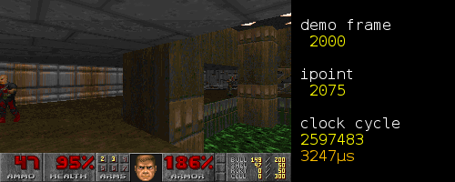

"Headless Doom" is a benchmark/test program based on Doom. I have used
it for testing compilers, CPU simulators, FPGA hardware, timing analysis
software and a coverage testing tool. It is written in C, with some GCC
extensions, and is portable to any 32/64-bit platform supported by
GCC or Clang.

Over more than ten years, I used versions of "Headless Doom" on 
x86 Linux, x64 Linux, x86 Windows, Microblaze (bare metal), Android and 
ARM Linux (RPi, RPi model 2, and Pandaboard). It uses the original 
source code release from id Software, with some bug fixes and 
modifications of my own. This source code is demo-compatible with
the original MS-DOS game and renders the game at the original 320x200
resolution.

# Requirements:

To run the benchmark or the test, you will need Ultimate Doom. You can
[buy a copy of the game from Steam](https://store.steampowered.com/app/2280/DOOM_1993/).

You will need the `doom.wad` data file, which must have the following MD5 sum:

    c4fe9fd920207691a9f493668e0a2083  doom.wad

In the Steam edition of the game, this file is found in the Steam directory
in a subdirectory such as `steamapps\common\Ultimate Doom\base`.

It may also be obtained by updating the registered MS-DOS version of Doom
to Ultimate Doom [using the official patches](https://www.doomworld.com/classicdoom/info/patches.php).

The benchmark and test both make use of "Doom Done Quick", a speedrun
that completes all 32 non-secret levels in under 20 minutes. The original
"DdQ-1941.zip" archive is included. For more details of DdQ, see:
http://quake.speeddemosarchive.com/quake/qdq/movies/ddq.html

# Instructions:

Run `make` to compile with GCC, or build the project in Visual Studio.

Copy `doom.wad` into the `headless\_doom` directory,
and unzip `DdQ-1941.zip` into the `headless\_doom` directory.

Run `headless\_doom.exe` to run the benchmark. This runs through 32 levels
of the game by playing the "Doom Done Quick" demo, then exits. As a final
step, the program prints the total time that elapsed. The program does not 
use your computer's real-time clock: all frames are rendered, regardless
of CPU speed.

Run `headless\_doom.exe test` to run the test. This does the same thing as the benchmark,
but also computes the CRC-32 of each frame rendered, and compares this 
against a "known good" list. As a result it's significantly slower. This
mode can be used to detect subtle software and hardware errors.

Other options (`write_crc`, `write_pcx`) recompute the CRC file `crc.dat` and write out
a screenshot for each frame respectively.

# Typical benchmark timings:

    Platform                     Compiler        Typical time

    RPi 2 (ARMv7 1GHz)           GCC 4.6.3       77.3s
    RPi (ARMv6 700MHz)           GCC 4.6.3       217.1s
    RPi 3 (Cortex-A53 1.2GHz)    GCC 10.2.1      54.0s
    Linux x86 (Core2 E8600)      GCC 4.7.2       10.3s
    Linux x64 (Core2 E8600)      GCC 4.7.2       9.4s
    Windows x86 (Core i5 2500)   GCC 4.7.4       6.8s
    Windows x64 (Core i3 8350)   GCC 8.3.1       5.3s
    Windows x64 (Core i3 8350)   MSVC 2019       4.7s
    Linux x64 (Core i3 3220)     GCC 4.7.2       6.9s
    Linux x86 (Core i3 3220)     GCC 4.1.2       7.5s
    Android 11.0 (SDMMAGPIE)     Clang 10.0.1    9.6s
    Linux PowerPC (E500)         GCC 4.9.2       81.4s
    Android 6.0 (Snapdragon 410) Clang 3.9.0     69.3s
    W10 Linux x64 (AMD A6-6310)  GCC 4.8.4       17.1s

The CRC test typically requires 25% more time.

I am interested in benchmark timings on unusual or vintage hardware - if you
would like to contribute these, please send them by email.

# Videos:

The Doom Done Quick demo may be watched here:
   https://www.youtube.com/watch?v=oZGRL8-bhhw

(This is not a recording of Headless Doom, which spends less time on the
title screens etc.)

Doom's rendering process is shown here:
   https://www.youtube.com/watch?v=ujXrQVyl610

The screenshot at the top of this file comes from this video. It shows
Headless Doom running on a PowerPC E500 with execution slowed by
a factor of 16667, so that 60 microseconds of CPU time is one second of
video time. You can see how the game draws the walls, floor and sprites. See
also: https://www.jwhitham.org/2016/03/a-detailed-timing-trace-with-video.html )

